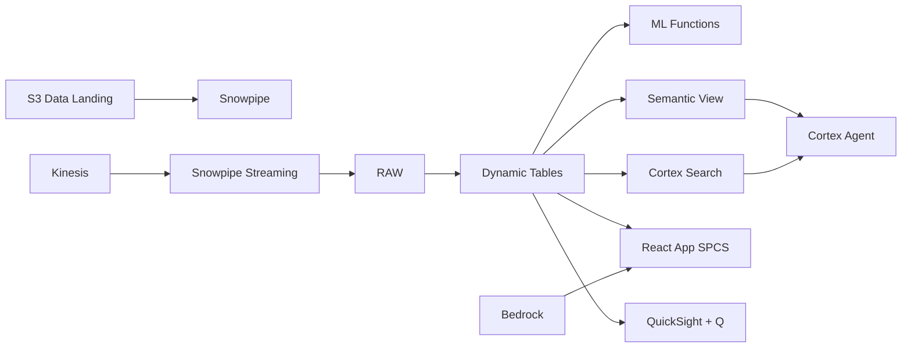

# Sukuk Portfolio Analytics

Sovereign and corporate Sukuk analytics for Indonesia's US$64B Islamic capital market — Dynamic Tables build real-time portfolio views, ML.FORECAST projects yield curves, and Cortex AI answers portfolio questions.

## Architecture

Indonesia's Islamic capital market has reached US$64 billion, with sovereign SBSN dominating issuance. An Islamic fund managing Rp 45 trillion needs real-time portfolio intelligence — yield forecasting, BI rate sensitivity analysis, and AI-generated investment commentary — as it navigates potential rate cuts and corporate credit deterioration.



## Snowflake Capabilities

| Capability | Implementation |
|-----------|---------------|
| Dynamic Tables | PORTFOLIO_SUMMARY / YIELD_CURVES / ISSUER_RISK / MATURITY_LADDER |
| ML Functions | ML.FORECAST |
| Cortex AI | COMPLETE, AI_EXTRACT, SUMMARIZE |
| Cortex Search | 60 documents indexed |
| Cortex Agent | SUKUK_PORTFOLIO_AGENT |
| Semantic View | SUKUK_PORTFOLIO_ANALYTICS |
| React App (SPCS) | 5 tabs + DemoGuide |


## AWS Services

| Service | Role in Demo |
|---------|-------------|
| Amazon Kinesis | Stream real-time market data and pricing feeds |
| Apache Iceberg (S3) | Open table format for cross-institution portfolio sharing |
| AWS Glue | ETL for market data transformation |
| Amazon Athena | Ad-hoc query on Iceberg tables |
| Amazon Bedrock (Claude) | Generate portfolio commentary |
| Amazon QuickSight + Q | Portfolio dashboard with natural language |


## Personas

| Persona | Role | Key Questions |
|---------|------|---------------|
| **H. Muhammad Faisal** | CIO Islamic Fund | "What is our portfolio's weighted average yield?" "How does sovereign vs corporate allocation compare to benchmark?" |
| **Dian Pratiwi** | Fixed Income Portfolio Manager | "Show me the maturity ladder for next 12 months." "What's the spread between SBSN and corporate Sukuk?" |


## Data

| Table | Rows | Description |
|-------|------|-------------|
| SUKUK_HOLDINGS | 800 | Portfolio holdings across sovereign (SBSN) and corporate Sukuk structures |
| VALUATIONS | 20,000 | Daily mark-to-market valuations for all holdings |
| ISSUERS | 150 | Issuer profiles with credit ratings and Shariah board approvals |
| MARKET_DATA | 80,000 | BI rate, JIBOR, benchmark yields, and interbank Islamic rates |
| PORTFOLIO_DOCS | 60 | Investment committee papers, Sukuk prospectuses, and Shariah opinions |


## Build Instructions

### Prerequisites
- Snowflake account with ACCOUNTADMIN access
- Cortex AI enabled (ML Functions, Search, Agent)
- Warehouse: SUKUK_WH (Medium)
- AWS CLI with access (us-west-2)

### Deployment

```bash
snowsql -f snowflake/00_setup.sql
snowsql -f snowflake/01_marketplace_install.sql
snowsql -f snowflake/02_raw_tables.sql
snowsql -f snowflake/03_staging.sql
snowsql -f snowflake/04_dynamic_tables.sql
snowsql -f snowflake/05_search.sql
snowsql -f snowflake/06_ml_models.sql
snowsql -f snowflake/07_semantic_view.sql
snowsql -f snowflake/08_agent.sql
```

### React App (SPCS)
```bash
cd app && npm ci && npm run build
docker build -t aws-indonesia-islamic-finance-sukuk-app .
docker push bdiqc8sm-default.registry.snowflakecomputing.com/islamic_sukuk_indonesia/app/aws_indonesia_islamic_finance_sukuk/app:latest
```

### Demo Mode
Open the app URL with `?demo=true` for presenter view.

## Build Modes

### Snowflake Only
Run scripts 00-08 (skip AWS-specific integration). Uses:
- **Snowpipe Streaming SDK** instead of Amazon Kinesis
- **Snowflake Managed Iceberg Tables** instead of Apache Iceberg (S3)
- **Dynamic Tables** instead of AWS Glue
- **Snowflake SQL on Iceberg** instead of Amazon Athena
- **Cortex Complete** instead of Amazon Bedrock (Claude)
- **Snowflake Intelligence (Cortex Analyst)** instead of Amazon QuickSight + Q

### Full AWS + Snowflake
Run all scripts including AWS integration. Deploy QuickSight dashboard from `quicksight/`.

## Business Impact

Industry research and Snowflake customer outcomes:
- **Indonesia is the world's largest sovereign sukuk issuer — $55B outstanding in 2024, 20% of total government debt** — [Ministry of Finance Indonesia](https://www.djppr.kemenkeu.go.id/en/page/load/1)
- **Global sukuk issuance reached $195B in 2024 — Indonesia, Saudi Arabia, and Malaysia account for 75%** — [S&P Global Ratings](https://www.spglobal.com/ratings/en/research-insights/special-reports/islamic-finance-outlook-2025)
- **Green sukuk and sustainability-linked sukuk growing 35% annually — Indonesia issued world's first green sukuk in 2018** — [Climate Bonds Initiative](https://www.climatebonds.net/resources/reports/green-sukuk)
- **Western Union** (Snowflake customer): processes 1B+ cross-border transactions on Snowflake with real-time compliance monitoring across 200+ countries -- [snowflake.com/customers/western-union](https://www.snowflake.com/en/customers/all-customers/case-study/western-union/)

## Key Demo Numbers

- **Rp 45T** Sukuk portfolio AUM (60% sovereign, 40% corporate)
- **800 holdings** across SBSN and corporate Sukuk
- **7.8%** weighted average yield (45bps above benchmark)
- **2 issuers** on watchlist following credit review
- **80,000 data points** market data refreshed every 2 hours


## License

Apache 2.0 — See [LICENSE](LICENSE) for details.

This is a personal demo project and is not an official Snowflake offering. It comes with no support or warranty.